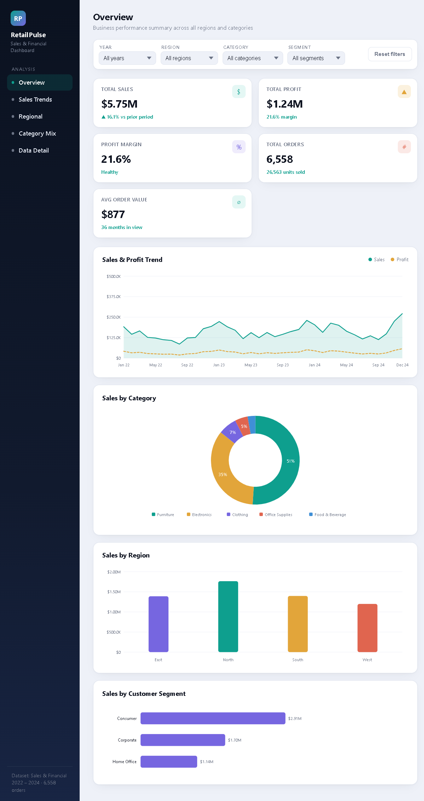
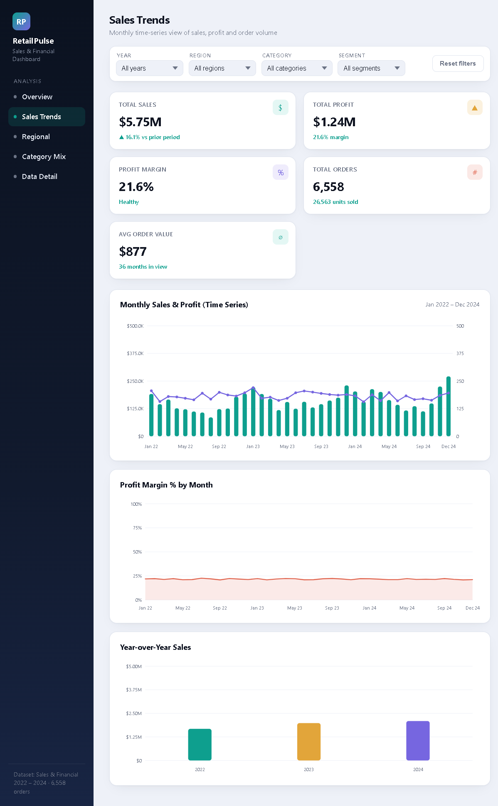
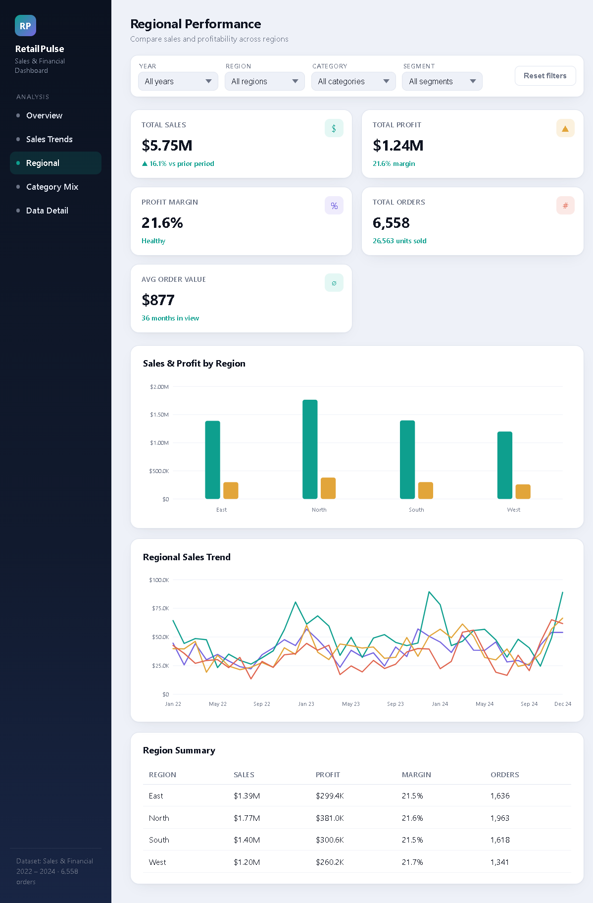
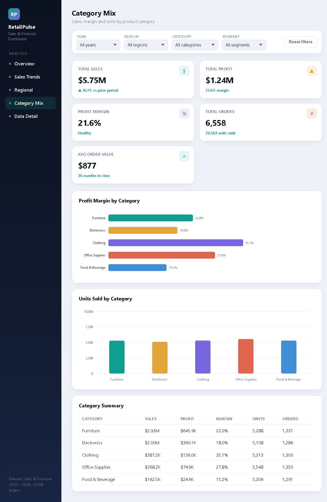
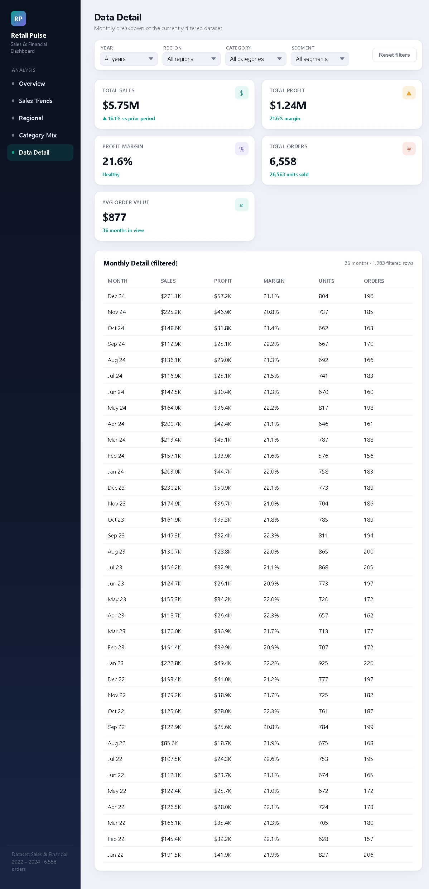

# RetailPulse — Sales & Financial Dashboard

An interactive dashboard built for business stakeholders to explore sales, profit, and growth trends across regions, categories, and customer segments.

## 🎯 Objective
Design an interactive dashboard that helps business stakeholders make informed decisions using sales and financial data.

## 🛠️ Tools & Tech
- HTML, CSS, JavaScript (vanilla — no external dependencies)
- Custom SVG charting (line, bar, grouped bar, donut, combo charts)
- PowerPoint summary generated with pptxgenjs

## 📦 Deliverables
- `sales_financial_dashboard.html` — the interactive dashboard
- `RetailPulse_Dashboard_Summary.pptx` — executive summary deck
- `sales_financial_dataset.csv` — underlying sales & financial dataset (2022–2024)

## 📊 Dataset
Sales & Financial dataset — 6,558 orders across 3 years (2022–2024), covering Region, Category, Segment, Quantity, Sales, and Profit.

## ✨ Dashboard Features
- **Navigation menu** — Overview, Sales Trends, Regional, Category Mix, Data Detail
- **Slicers/filters** — Year, Region, Category, Segment
- **KPI cards** — Total Sales, Total Profit, Profit Margin, Total Orders, Avg Order Value
- **Time-series analysis** — monthly sales, profit, and margin trends
- **Consistent color theme** — teal / amber / violet / coral across every chart

## 📸 Screenshots

**Overview**


**Sales Trends**


**Regional Performance**


**Category Mix**


**Data Detail**


## 🔗 Live Demo / Link
https://htmlpreview.github.io/?https://github.com/sanketnadapurohit10-coop/retailpulse-sales-dashboard/blob/main/sales_financial_dashboard%20(1).html

## 💡 Key Insights
- Sales grew 24.6% from FY2022 ($1.68M) to FY2024 ($2.09M)
- Furniture and Electronics drive 86% of total sales
- Clothing has the highest profit margin at 35.1%
- North is the top-performing region; West has the most room to grow

## 📈 Outcome
This project demonstrates how to turn raw sales & financial data into a self-service dashboard that helps stakeholders make faster, data-informed decisions.
```

